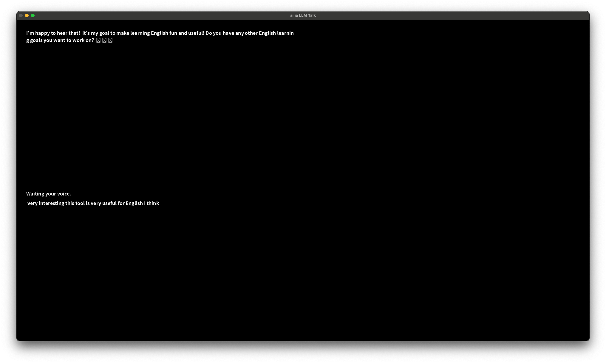

# ailia LLM Talk

## about

ailia LLM Talk is a sample application for conversing with AI entirely offline.
It uses ailia AI Speech for voice recognition, ailia AI Voice for voice synthesis, and ailia LLM for text generation.
Once the model is downloaded, it operates completely offline.

## demo

By having conversations with AI, it serves as a demonstration of studying English.



## setup

```
brew install portaudio
pip3 install -r requirements.txt
```

## run

```
python3 main.py
```
